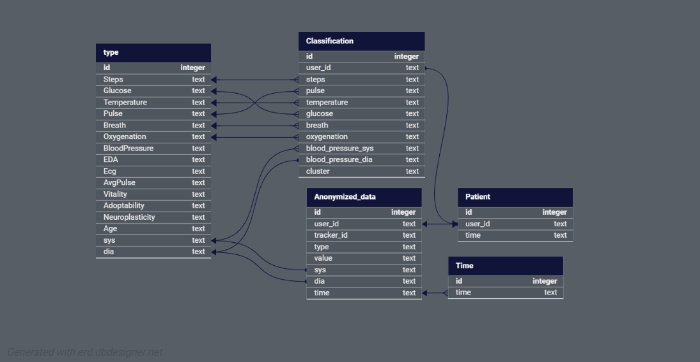
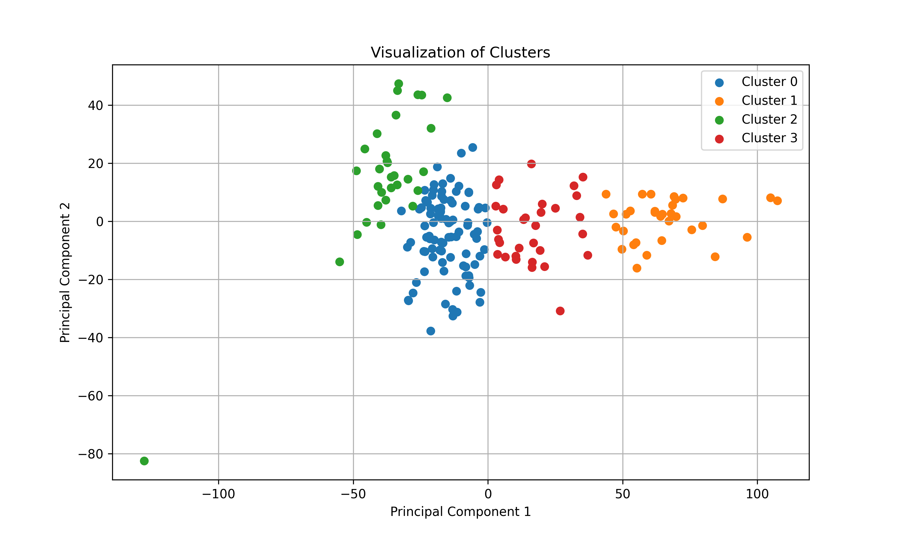
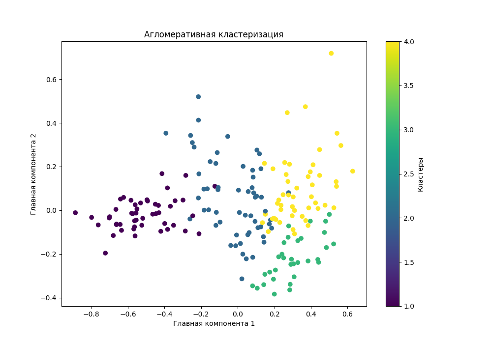
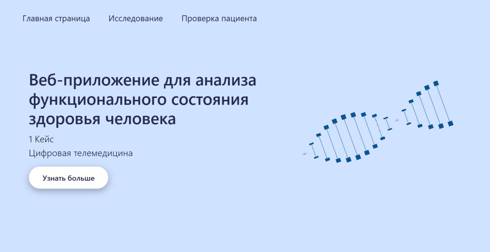
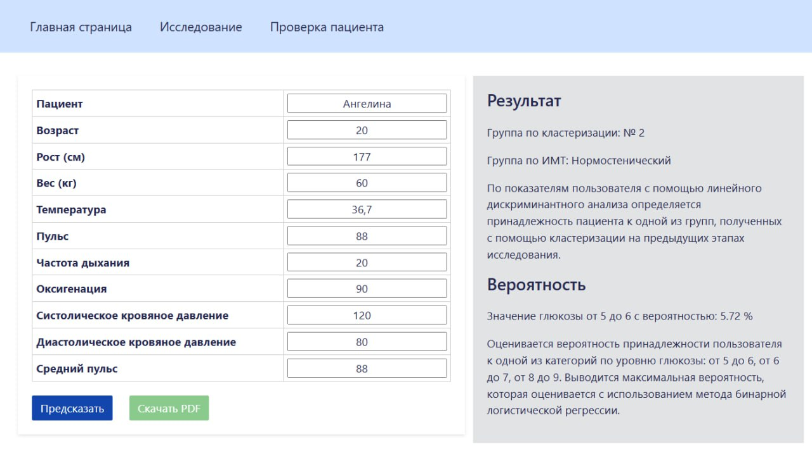

# Telemedicine

## Этапы работы:
### 1. Обработка csv файлов и работа с базой данных
- Для удобной работы с данными была использована СУБД MySQL со следующей структурой:

Данные были записаны из csv файлов:
- Обезличенные данные.csv - общий файл с 14 паказателями по каждому user_id и временем записи
- [users.csv](data/users.csv) - файл с биологическими показателями (такими как рост, вест и тд.)
- [gender.csv](data/gender.csv) - файл с полом пациентов

### 2. Во время работы с данными, были замеченны 908 тестовых пациентов с целыми значениями по каждому показателю, в дальнейшей работе мы их не использовали 
- [test_data.txt](data/test_data.txt)

### 3. Были удалены записи с показателями, которые выходят за максимальные или минимальные значения, возможные у человека(удалены записи с высокой температуров в 80 градусов, средним пульсом в 500 и другие)
### 4. Разделение пациентов на 4 группы по индексу массы тела(по индексу массы тела, с учетом возраста) 
- [imt.py](clustering/imt.py)

4 группы:
- астенический: 0
- нормостенический: 14
- мезоморф: 5
- ожирение: 7
### 5. Подготовка данных для кластеризации(вычисление максимальных, минимальных, средних значений, медиан и стандартных отклонений по каждому показателю) 
- [data_aggregation.py](data_processing/data_aggregation.py)
### 6. Кластеризация методом Kmeans 
Метод K-средних (K-Means) — это алгоритм кластеризации, который разделяет данные на K групп, минимизируя внутрикластерные расстояния, то есть расстояния между точками внутри каждого кластера и центром этого кластера
#### Этапы
1. Определяется количество кластеров k и случайным образом выбираются начальные центры кластеров.
2. Каждая точка данных присваивается ближайшему центру кластера на основе выбранной метрики (евклидова расстояния).
3. Центры кластеров пересчитываются как среднее значение всех точек, отнесённых к каждому кластеру.
4. Процесс продолжается, пока центры кластеров не перестанут изменяться или не достигнет максимального числа итераций.

Результат:
Кластер 1: 94 пациентов
Кластер 2: 32 пациентов
Кластер 3: 31 пациентов
Кластер 4: 31 пациентов

- [kmeans.py](clustering/kmeans.py)
 
- [kmeans-new-data.xlsx](data/kmeans-new-data.xlsx)

### 7. Агломеративная иерархическая кластеризация с использованием метода Уорда 
Существует несколько видов иерархических кластеризации
1. Агломеративная кластеризация (каждый объект данных представляет отдельный кластер, кластеры постепенно объединяются на основе их схожести, пока не остается один общий кластер. На каждом шаге выбирается пара кластеров с наименьшим расстоянием между ними и объединяются)
2. Дивизивная кластеризация (Начинается с одного общего кластера, содержащего все объекты данных, постепенно делятся на подмножества, пока каждый объект не станет отдельным кластером)

В нашем случае, больше подойдет агломеративная кластеризация(так как у нас довольно большой объем данных)

Метод Уорда — это метод агломеративной иерархической кластеризации, который минимизирует внутрикластерную дисперсию при объединении кластеров. Метод Уорда фокусируется на минимизации увеличения суммы квадратов ошибок (SSE), что приводит к более компактным кластерам.
#### Этапы
1. Каждая точка данных рассматривается как отдельный кластер.
2. На каждой итерации объединяются два кластера, которые приводят к наименьшему увеличению внутрикластерной дисперсии.
3. Процесс продолжается, пока не объединятся все кластеры или пока не будет достигнут желаемый уровень агрегации.

- [agglomerative_clustering.py](clustering/agglomerative_clustering.py)
- [Agglomerative_clustering](clustering/Agglomerative_clustering.txt)

Результат:
Кластер 1: 49 пациентов
Кластер 2: 58 пациентов
Кластер 3: 32 пациентов
Кластер 4: 49 пациентов

### 8. Расчет корреляции между глюкозой и максимальным, минимальным и средним значениями других показателей
- [correlation](correlation.py)
### 9. Линейный дискриминантный анализ для определения группы пациента 
- [Подготовка данных для линейного дискриминантного анализ](data_processing/lda.py)

  По показателям пользователя с помощью линейного дискриминантного анализа определяется принадлежность пациента к одной из групп, полученных с помощью кластеризации на предыдущих этапах исследования.
  
### 10. Бинарная логистическая регрессия для определения вероятности уровня глюкозы
- [Binary_logistic_regression.py](Binary_logistic_regression.py)
  
  Оценивается вероятность принадлежности пользователя к одной из категорий по уровню глюкозы: от 5 до 6, от 6 до 7, от 8 до 9. Выводится максимальная вероятность, которая оценивается с использованием метода бинарной логистической регрессии.
  
  Зависимая переменная – дихотомическая.
  
  Вероятность наступления события для некоторого случая рассчитывается по формуле:
  
      p = 1 / 1+e^(-z)
  
  Уравнение логистической регрессии:
  
      z = b1 x1 + ... + bn xn + a
  
  x - значения независимых переменных, b - коэффициенты, расчет которых является задечей логистической регрессии, а - константа.
  ### 11. Веб-приложение для анализа функционального состояния здоровья человека
Мы разработали веб-приложение с использованием фреймворка django

